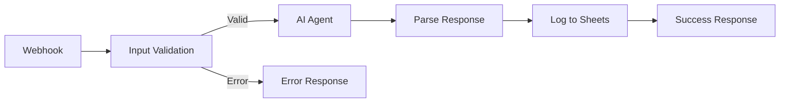

# 🛫 Flight Search Agent - Quick Start

> **Automatischer AI-Agent für Flugsuche bei Geschäftsterminen**

---

## 🚀 Schnellstart in 3 Schritten

### 1️⃣ Import Workflow
```
1. n8n öffnen
2. Workflows → "Import from File"
3. Datei wählen: flight-search-agent.json
```

### 2️⃣ Credentials einrichten
```
Benötigt:
✅ OpenRouter API (für Claude 3.5 Sonnet)
✅ SerpAPI (für Google Flights - 100 gratis Suchen/Monat)
✅ Google Sheets OAuth2 (optional, für Logging)
```

### 3️⃣ Workflow aktivieren & testen
```bash
# Nach Aktivierung bekommst du eine Webhook URL
POST http://localhost:5678/webhook/flight-search

# Test-Request
curl -X POST http://localhost:5678/webhook/flight-search \
  -H "Content-Type: application/json" \
  -d '{
    "termin": {
      "datum": "2026-03-15",
      "zeit_von": "09:00",
      "zeit_bis": "17:00"
    },
    "ort": "Berlin"
  }'
```

---

## 📋 Was macht der Agent?

### Input (JSON via Webhook)
```json
{
  "termin": {
    "datum": "2026-03-15",      // Termin-Datum (YYYY-MM-DD)
    "zeit_von": "09:00",        // Termin-Start (HH:MM)
    "zeit_bis": "17:00"         // Termin-Ende (HH:MM)
  },
  "ort": "Berlin"               // Zielstadt
}
```

### Agent-Logik
1. ✈️ Sucht von **3 Abflughäfen** (CGN, FRA, DUS)
2. ⏰ Findet **Tagesflüge** mit passendem Zeitfenster
3. 🎯 Hinflug **VOR** Termin-Start, Rückflug **NACH** Termin-Ende
4. 🏆 Sortiert nach **Gesamtreisezeit** (kürzeste zuerst)
5. 📊 Loggt alle Ergebnisse in **Google Sheets**

### Output (JSON Response)
```json
{
  "status": "success",
  "ergebnis": {
    "anzahl_fluege": 2,
    "fluege": [
      {
        "outbound": {
          "from": "CGN",
          "to": "BER",
          "departure_time": "06:30",
          "arrival_time": "07:45",
          "airline": "Lufthansa",
          "flight_number": "LH2134"
        },
        "return": {
          "from": "BER",
          "to": "CGN",
          "departure_time": "18:30",
          "arrival_time": "19:50",
          "airline": "Lufthansa",
          "flight_number": "LH2139"
        },
        "total_price_eur": 189
      }
    ]
  }
}
```

---

## 🏗️ Workflow-Struktur



### Nodes im Detail

| # | Node | Funktion |
|---|------|----------|
| 1 | **Webhook** | Empfängt POST requests |
| 2 | **Validate Input** | 3-Ebenen Validierung (Datum, Zeit, Logik) |
| 3 | **Check Validation** | IF-Node für Error-Handling |
| 4 | **AI Agent** | Claude 3.5 Sonnet orchestriert Flugsuche |
| 5 | **OpenRouter LLM** | LLM-Provider (verbunden mit AI Agent) |
| 6 | **SerpAPI Google Flights** | Tool für Flugsuche (verbunden mit AI Agent) |
| 7 | **Parse Agent Response** | Validiert & strukturiert JSON-Output |
| 8 | **Log to Google Sheets** | Speichert alle Requests |
| 9 | **Webhook Response** | Sendet Ergebnis zurück |
| 10/11 | **Error Handlers** | 400-Responses + Error Logging |

---

## 🛡️ Error Handling (3 Ebenen)

### Ebene 1: Input Validation
```javascript
❌ "Pflichtfeld fehlt: termin.datum"
❌ "Ungültiges Datumsformat. Erwartet: YYYY-MM-DD"
❌ "termin.zeit_bis muss nach termin.zeit_von liegen"
→ Sofortige 400-Response, KEINE API-Aufrufe
```

### Ebene 2: Agent Response Validation
```javascript
❌ "Missing required field: status"
❌ "Invalid status: xyz. Must be: success|no_flights|error"
❌ "Each flight must have outbound and return"
→ Status "error" in Response
```

### Ebene 3: Global Error Handler
```javascript
❌ Fängt unerwartete Runtime-Fehler
❌ Loggt Stack Trace in Google Sheets
→ Verhindert 500-Errors
```

---

## 📊 Google Sheets Logging

**Alle Requests werden automatisch geloggt:**

| Timestamp | Request_ID | Termin | Ort | Status | Flüge | Beste_Option | Agent_Log | Errors |
|-----------|------------|--------|-----|--------|-------|--------------|-----------|--------|
| 2026-02-05 19:00 | flight_123 | 2026-03-15 | Berlin | success | 2 | {...} | Agent response | - |
| 2026-02-05 19:05 | flight_124 | - | - | error | 0 | - | - | Validation failed |

→ Perfekt für **Debugging**, **Analytics** und **Audit-Logs**

---

## 🧪 20 Test-Cases verfügbar

Siehe: `test-data/flight-search-test-cases.json`

**Kategorien:**
- ✅ **8 Success-Cases** (Berlin, München, Hamburg, Wien, Zürich, ...)
- ❌ **10 Validation-Error-Cases** (fehlende Felder, falsche Formate, ...)
- 🔍 **2 No-Flights-Cases** (enges Zeitfenster, exotisches Ziel)

**Quick-Test:**
```bash
# Success Test
curl -X POST http://localhost:5678/webhook/flight-search \
  -H "Content-Type: application/json" \
  -d '{"termin":{"datum":"2026-03-15","zeit_von":"09:00","zeit_bis":"17:00"},"ort":"Berlin"}'

# Error Test (fehlendes Datum)
curl -X POST http://localhost:5678/webhook/flight-search \
  -H "Content-Type: application/json" \
  -d '{"termin":{"zeit_von":"09:00","zeit_bis":"17:00"},"ort":"Berlin"}'
```

---

## 💰 Kosten pro Request

| Service | Kosten |
|---------|--------|
| OpenRouter (Claude 3.5) | ~$0.003-0.015 |
| SerpAPI Google Flights | ~$0.05 (oder gratis in 100/Monat Quota) |
| Google Sheets | $0 (gratis) |
| **GESAMT** | ~**$0.05-0.07** |

**100 Flugsuchen/Monat = ~$5-7** (bei SerpAPI Gratis-Plan: fast kostenlos!)

---

## ⚙️ Konfiguration

### Weitere Abflughäfen hinzufügen
```javascript
// Im AI Agent Node → Text Feld ändern:
"Suche Flüge von: CGN, FRA, DUS, STR, HAM"
```

### LLM-Temperatur anpassen
```javascript
// Im OpenRouter LLM Node:
Temperature: 0.3  // Standard
Temperature: 0.1  // Sehr deterministisch
Temperature: 0.7  // Mehr Varianz
```

### Kleineres/günstigeres LLM
```javascript
// Im OpenRouter LLM Node:
Model: "anthropic/claude-3.5-sonnet"    // Standard
Model: "anthropic/claude-3-haiku"       // ~10x günstiger
Model: "google/gemini-flash-1.5"        // Ebenfalls günstig
```

---

## 📚 Dokumentation

- 📖 **Vollständige Setup-Anleitung:** `docs/flight-search-agent-setup.md`
- 🧪 **Test-Cases:** `test-data/flight-search-test-cases.json`
- 🔧 **Workflow JSON:** `workflows/flight-search-agent.json`

---

## 🎯 Use Cases

### 1. Geschäftsreise-Portal
```javascript
// Integration in deine App:
const response = await fetch('http://localhost:5678/webhook/flight-search', {
  method: 'POST',
  headers: {'Content-Type': 'application/json'},
  body: JSON.stringify({
    termin: userAppointment,
    ort: userDestination
  })
});
const flights = await response.json();
```

### 2. Slack Bot
```
/flugsuche Berlin 2026-03-15 09:00-17:00
→ Bot sendet Request an Webhook
→ Agent findet Flüge
→ Bot postet Ergebnisse im Channel
```

### 3. Email-Automation
```
Email mit Termindaten kommt an
→ n8n Email Trigger parst Email
→ Ruft Flight Search Agent auf
→ Sendet Flugangebote als Antwort-Email
```

### 4. CRM Integration
```
Neuer Deal in CRM mit Reisetag
→ Webhook an Flight Search Agent
→ Beste Flugoption wird in CRM-Notiz eingetragen
```

---

## 🐛 Troubleshooting

| Problem | Lösung |
|---------|--------|
| "Credential not found" | Alle 3 Credentials prüfen & Workflow speichern |
| "SerpAPI quota exceeded" | Account prüfen (100/Monat gratis) oder upgraden |
| "Agent returns no JSON" | Max Tokens auf 4000 erhöhen |
| "Google Sheets denied" | OAuth2 neu verbinden, Sheet-Freigabe prüfen |
| "Keine Flüge gefunden" | SerpAPI Playground testen, Zeitfenster prüfen |

**Mehr Details:** `docs/flight-search-agent-setup.md`

---

## ✅ Feature-Highlights

✨ **Vollautomatisch** - Keine manuelle Suche mehr  
✨ **3 Flughäfen** - CGN, FRA, DUS  
✨ **Intelligente Zeitfenster** - AI versteht Geschäftslogik  
✨ **3-Ebenen Validierung** - Robuster als 99% aller APIs  
✨ **Native n8n Nodes** - Keine HTTP Request Hacks  
✨ **Google Sheets Logging** - Volle Transparenz  
✨ **20 Test-Cases** - Production-Ready  

---

## 📞 Support

- 📖 **Dokumentation:** `docs/flight-search-agent-setup.md`
- 💬 **n8n Community:** [community.n8n.io](https://community.n8n.io)
- 🐛 **Issues:** GitHub Repository

---

**Happy Flying! 🛫**
